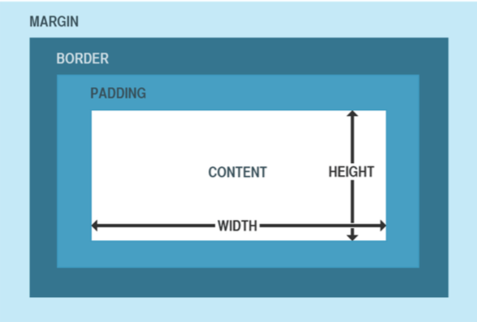

# CSS


## 目录

* [CSS概述](#CSS概述)
  * [单位](#单位)
  * [颜色](#颜色)
* [CSS选择器](#CSS选择器)
  * [基本选择器及其扩展](#基本选择器及其扩展)
    * [ID选择器](#ID选择器)
    * [类选择器](#类选择器)
    * [元素选择器](#元素选择器)
    * [复合选择器](#复合选择器)
    * [群组选择器](#群组选择器)
    * [后代选择器](#后代选择器)
    * [子元素选择器](#子元素选择器)
    * [兄弟选择器](#兄弟选择器)
    * [通用选择器](#通用选择器)
  * [伪类与伪元素选择器](#伪类与伪元素选择器)
    * [链接伪类](#链接伪类)
    * [动态伪类](#动态伪类)
    * [表单伪类](#表单伪类)
    * [结构性伪类](#结构性伪类)
    * [伪元素](#伪元素)
    * [否定伪类](#否定伪类)
  * [属性选择器](#属性选择器)
* [继承](#继承)
* [选择器的权重](#选择器的权重)
  * [权重的计算](#权重的计算)
* [文本样式](#文本样式)
* [背景](#背景)
* [浮动](#浮动)
  * [文档流](#文档流)
  * [浮动概述](#浮动概述)
  * [清除浮动](#清除浮动)
* [定位](#定位)
  * [相对定位](#相对定位)
  * [绝对定位](#绝对定位)
  * [固定定位](#固定定位)
  * [提升元素层级](#提升元素层级)
* [盒子模型](#盒子模型)
  * [盒子](#盒子)
  * [盒子组成](#盒子组成)
    * [内容区](#内容区)
    * [内边距](#内边距)
    * [边框](#边框)
    * [外边距](#外边距)
  * [display](#display)
  * [visibility](#visibility)
  * [overflow](#overflow)
* [表格的样式](#表格的样式)


## CSS概述

什么是CSS？
 
* 层叠样式表 (Cascading Style Sheets)
* css可以用来为网页创建样式表,通过样式表可以对网页进行装饰
* 所谓层叠,可以将整个网页想象成是一层一层的结构,层次高的将会覆盖层次低的
* 而css就可以分别为网页的各个层次设置样式

基本语法:

* CSS的样式表由一个一个的样式构成,一个样式又由选择器和声明块构成。
* 语法:选择器 {样式名:样式值;样式名:样式值 ; },例如:`p {color:red ; font-size:12px;}`

* 行内样式
  可以直接将样式写到标签内部的style属性中,这种样式不用填写选择器,直接编写声明即可
  ```
  <p style="color: red;font-size: 30px"></p>
  ```
  这种方式编写简单,定位准确。但是由于直接将css代码写到了html标签的内部,导致结构与表现耦合,同时导致样式不能够复用,所以这种方式我们不推荐使用。
* 内部样式表
  可以直接将样式写到<style>标签中
  ```
  <style type="text/css">
  p{color:red; font-size: 30px;}
  </style>
  ```
  这样使css独立于html代码,而且可以同时为多个元素设置样式,这是我们使用的比较多的一种方式。
  但是这种方式,样式只能在一个页面中使用,不能在多个页面中重复使用。
* 外部样式表
  可以将所有的样式保存到一个外部的css文件中,然后通过<link>标签将样式表引入到文件中。
  ```
  <link rel="stylesheet" type="text/css" href="style.css">
  ```
  这种方式将样式表放入到了页面的外部,可以在多个页面中引入,同时浏览器加载文件时可以使用缓存,这是我们开发中使用的最多的方式。
  
### 单位

* px:如果我们将一个图片放大的话,我们会发现一个图片是有一个一个的小色块构成的,这一个小色块就是一个像素,也就是1px,对于不同的显示器来说一个像素的大小是不同的。
* 百分比:也可以使用一个百分数来表示一个大小,百分比是相对于父元素来说的,如果父元素使用的大小是16px,则100%就是16px,200%就是32px。
* em:em和百分比类似,也是相对于父元素说的,1em就相当于100%,2em相当于200%,1.5em相当于150%。

### 颜色

• 在CSS中可以直接使用颜色的关键字来代表一种颜色。
• 17种颜色:aqua、black、blue、fuchsia、gray、green、 lime、maroon、navy、olive、orange、 purple、red、silver、teal、white、yellow。
• 还有147种svg颜色,这里就不一一列举了,但是明显即使这些颜色变成double,也不足以描绘我们世界中所有的颜色。

#### 十六进制颜色

* 用的最多的颜色是十六进制符号。一个颜色值,比如:#6600FF实际上包含了三组十六进制的数字。
* 上边的例子中66代表红色的浓度,00代表绿色的浓度,FF代表了蓝色的浓度。最后的颜色是由这些指定浓度的红绿蓝混合而成的。
* 如果每一组数中的两个数字都相同,就可以把十六进制的数字缩短为只有3个字符,如将#6600FF缩短为#60F。

#### RGB值
* 也可以使用计算机中常用的RGB值来表示颜色。可以使用0~255的数值,也可以使用0%~100%的百分比数。
  * RGB(100%,0%,0%)
  * RGB(0,255,0)
* 第一个数表示红色的浓度,第二个数表示绿色浓度,第三个数表示蓝色的浓度。

 RGBA
• RGBA表示一个颜色和RGB类似,只不过比RGB多了一个A(alpha)来表示透明度,透明度需要一个0-1的值。0表示完全透明,1表示完全不透明。
  * RGBA(255,100,5,0.5)


## CSS选择器

选择器(selector),会告诉浏览器:网页上的哪些元素需要设置什么样的样式。
比如:p这个选择器就表示选择页面中的所有的p元素,在选择器之后所设置的样式会应用到所有的p元素上。

### 基本选择器及其扩展

#### ID选择器

• ID选择器,可以根据元素的id属性值选取元素。
• 语法:`#id { }`
* 例子:
  ```
  <!DOCTYPE html>
  <html lang="en">
  <head>
      <meta charset="UTF-8">
      <title>Title</title>
      <style type="text/css">
          #box1 {
              border: 1px solid deeppink;
          }
      </style>
  </head>
  <body>
  
  <div id="box1">我是box1</div>
  <div id="box2">我是box2</div>
  
  </body>
  </html>
  ```

#### 类选择器

* 类选择器,可以根据元素的class属性值选取元素。
* 语法:`.className { }`
* 例如:
  ```
  <!DOCTYPE html>
  <html lang="en">
  <head>
      <meta charset="UTF-8">
      <title>Title</title>
      <style type="text/css">
          .all {
              border: 10px double deeppink;
          }
      </style>
  </head>
  <body>
  
  <h1 class="all">我是h1标签</h1>
  <div class="all">我是div标签</div>
  <p class="all">我是p标签</p>
  
  <a href="#" class="all">我是a标签</a>
  <span class="all">我是span标签</span>
  
  
  </body>
  </html>
  ```

#### 元素选择器

* 元素选择器(标签选择器),可以根据标签的名字来从页面中选取指定的元素。
* 语法:`标签名 { }`
* 例如:
  ```
  <!DOCTYPE html>
  <html lang="en">
  <head>
      <meta charset="UTF-8">
      <title>Title</title>
      <style type="text/css">
          div {
              border: 1px solid deeppink;
          }
  
          span {
              border: 1px solid blue;
          }
      </style>
  </head>
  <body>
  
  <div class="c1">我是c1</div>
  <div class="c2">我是c2</div>
  
  <span class="c1">我是c1</span>
  <span class="c2">我是c2</span>
  
  </body>
  </html>
  ```

#### 复合选择器

* 复合选择器,可以同时使用多个选择器,这样可以选择同时满足多个选择器的元素。
* 语法:`选择器1选择器2{}` 
* 例如:
  ```
  <!DOCTYPE html>
  <html lang="en">
  <head>
      <meta charset="UTF-8">
      <title>Title</title>
      <style type="text/css">
          div.c1 {
              border: 1px solid deeppink;
          }
      </style>
  </head>
  <body>
  
  <div class="c1">我是c1</div>
  <div class="c2">我是c2</div>
  
  <span class="c1">我是c1</span>
  <span class="c2">我是c2</span>
  
  </body>
  </html>
  ```

#### 群组选择器

* 群组选择器,可以同时使用多个选择器,多个选择器将被同时应用指定的样式。
* 语法:`选择器1,选择器2,选择器3 { }`
* 例如:
  ```
  <!DOCTYPE html>
  <html lang="en">
  <head>
      <meta charset="UTF-8">
      <title>Title</title>
      <style type="text/css">
          .c1, .c2 {
              margin: 10px;
              border: 1px solid deeppink;
          }
      </style>
  </head>
  <body>
  
  <div class="c1">我是c1</div>
  <div class="c2">我是c2</div>
  
  <span class="c1">我是c1</span>
  <span class="c2">我是c2</span>
  
  </body>
  </html>
  ```

#### 后代选择器

标签之间的关系:
* 祖先元素:直接或间接包含后代元素的元素。
* 后代元素:直接或间接被祖先元素包含的元素。
* 父元素:直接包含子元素的元素。
* 子元素:直接被父元素包含的元素。
* 兄弟元素:拥有相同父元素的元素。

* 后代选择器可以根据标签的关系,为处在元素内部的代元素设置样式。
* 语法:`祖先元素 后代元素 后代元素 { }`
* 例如:
  ```
  <!DOCTYPE html>
  <html lang="en">
  <head>
      <meta charset="UTF-8">
      <title>Title</title>
      <style type="text/css">
          div span {
              border: 1px solid deeppink;
          }
      </style>
  </head>
  <body>
  
  <div class="all">我是div标签 <span>我是span标签</span></div>
  
  <span>我是span标签</span>
  
  </body>
  </html>
  ```

#### 子元素选择器

* 子元素选择器可以给另一个元素的子元素设置样式。
* 语法:`父元素 > 子元素{}`
* 例如:
  ```
  <!DOCTYPE html>
  <html lang="en">
  <head>
      <meta charset="UTF-8">
      <title>Title</title>
      <style type="text/css">
          div > span {
              border: 1px solid deeppink;
          }
      </style>
  </head>
  <body>
  
  <div class="all">
      我是div标签
      <span>我是span标签</span>
      <p><span>我是span标签</span></p>
  </div>
  
  <span>我是span标签</span>
  
  </body>
  </html>
  ```

其他子元素选择器
• `:first-child`:选择第一个子标签
• `:last-child`:选择最后一个子标签
• `:nth-child`:选择指定位置的子元素
• `:first-of-type`:选择指定类型的第一个子元素
• `:last-of-type`:选择指定类型的最后一个子元素
• `:nth-of-type`:选择指定类型指定位置的子元素

#### 兄弟选择器

• 除了根据祖先父子关系,还可以根据兄弟 关系查找元素。
• 语法:
  * `兄弟元素 + 兄弟元素{}` 查找后边一个兄弟元素 
  * `兄弟元素 ~ 兄弟元素{}` 查找后边所有的兄弟元素
* 例如:
  ```
  <!DOCTYPE html>
  <html lang="en">
  <head>
      <meta charset="UTF-8">
      <title>Title</title>
      <style type="text/css">
          div + span {
              border: 1px solid deeppink;
          }
  
          a ~ span {
              border: 1px solid blue;
          }
      </style>
  </head>
  <body>
  
  <div class="all">
      <a href="#">我是a标签</a>
      <span>我是span标签</span>
      <span>我是span标签</span>
      <span>我是span标签</span>
      <p><span>我是span标签</span></p>
  </div>
  
  <span>我是span标签</span>
  
  </body>
  </html>
  ```

### 伪类与伪元素选择器

有时候,你需要选择本身没有标签,但是仍然易于识别的网页部位,比如段落首行或鼠标滑过的连接。CSS为他们提供一些选择器:伪类和伪元素。
给链接定义样式:有四个伪类可以让你根据访问者与该链接的交互方式,将链接设置成4种不同的状态。

#### 链接伪类

* `a:link`:正常链接
* `a:visited`:访问过的链接(只能定义字体颜色)

#### 动态伪类

* `a:hover`:鼠标滑过的链接
* `a:active`:正在点击的链接
* 例如:
  ```
  <!DOCTYPE html>
  <html lang="en">
  <head>
      <meta charset="UTF-8">
      <title>Title</title>
      <style type="text/css">
          a {
              text-decoration: none;
          }
  
          a:link, div:link {
              color: deeppink;
          }
  
          a:visited, div:visited {
              color: blue;
          }
  
          a:hover, div:hover {
              color: pink;
          }
  
          a:active, div:active {
              color: red;
          }
      </style>
  </head>
  <body>
  <a href="#">点我点我点我</a>
  <div>我是div啦</div>
  </body>
  </html>
  ```

#### 表单伪类

* `:focus`:获取焦点
* `:enabled`:
* `:disabled`:
* `:checked`:
* 例如:
  ```
  <!DOCTYPE html>
  <html lang="en">
  <head>
  	<meta charset="UTF-8">
  	<title>Title</title>
  	<style type="text/css">
  
  		input:focus {
  			background: pink;
  		}
  
  		input:enabled {
  			background: blue;
  		}
  
  		input:disabled {
  			background: deeppink;
  		}
  
  		input:checked {
  			font-size: 80px;
  		}
  	</style>
  </head>
  <body>
  
  <label>输入框<input type="text"/></label>
  <label>不可点击<input type="text" disabled="disabled"/></label>
  <label>复选框<input type="checkbox"/></label>
  
  </body>
  </html>
  ```
  
#### 结构性伪类

* `:before`:指定元素前
* `:after`:指定元素后
* `:selection`:选中的元素
* 例如:
  ```
  <!DOCTYPE html>
  <html lang="en">
  <head>
      <meta charset="UTF-8">
      <title>Title</title>
      <style type="text/css">
          #wrap {
              font: 30px/100px serif;
              background-color: lightgrey;
          }
  
          #wrap::before {
              display: inline-block;
              width: 50px;
              height: 50px;
              content: "";
              background: pink;
          }
  
          #wrap::after {
              display: inline-block;
              width: 50px;
              height: 50px;
              content: "";
              background: deeppink;
          }
  
          #wrap::selection {
              background-color: lightgreen;
          }
      </style>
  </head>
  <body>
  <div id="wrap">中国 ABC DEF GHI abc def ghi</div>
  </body>
  </html>
  ```

#### 伪元素

* `:first-letter`:首字母
* `:first-line`:首行
  
#### 否定伪类

* 否定伪类可以帮助我们选择不是其他东西的某件东西。
* 语法:`:not(选择器){}`
* 例如:

### 属性选择器

* 属性选择器可以挑选带有特殊属性的标签。
* 语法:
  * [属性名]
  * [属性名="属性值"]
  * [属性名~="属性值"]
  * [属性名|="属性值"]
  * [属性名^="属性值"]
  * [属性名$="属性值"]
  * [属性名*="属性值"]
* 例如:
    ```
    <!DOCTYPE html>
    <html lang="en">
    <head>
        <meta charset="UTF-8">
        <title>Title</title>
        <style type="text/css">
            div[name*="abc"] {
                border: 1px solid pink;
                margin: 10px;
            }
        </style>
    </head>
    <body>
    <div id="wrap">
        <div name="abc-def">abc-def</div>
        <div name="abc">abc</div>
        <div name="abc_def">abc_def</div>
        <div name="abc_def">abc_def</div>
        <div name="abc_">abc_</div>
    </div>
    </body>
    </html>
    ```

#### 通用选择器

* 通用选择器,可以同时选中页面中的所有元素。
* 语法:`*{ }`
* 例子:
  ```
  <!DOCTYPE html>
  <html lang="en">
  <head>
      <meta charset="UTF-8">
      <title>Title</title>
      <style type="text/css">
          * {
              border: 1px solid pink;
              margin: 10px;
          }
      </style>
  </head>
  <body>
  
  <h1>我是h1标签</h1>
  <div>我是div标签</div>
  <p>我是p标签</p>
  
  <a href="#">我是a标签</a>
  <span>我是span标签</span>
  
  
  </body>
  </html>
  ```
 


## 继承

* 就像父亲的财产会遗传给儿子一样,在CSS中祖先元素的样式同样也会被子元素继承。
* 继承是指应用在一个标签上的那些CSS样式会同时被应用到其内嵌标签上。
* 比如为父元素设置了字体颜色,子元素也会应用上相同的颜色。
* 当然并不是所有的样式都会被继承。


## 选择器的权重

在页面中使用CSS选择器选中元素时,经常都是一个元素同时被多个选择器选中。比如:`body h1` `h1`。
两个选择器都会选择h1元素,如果两个选择器设置的样式不一致那还好不会产生冲突,但是如果两个选择器设置的是同一个样式,这样h1到底要应用那个样式呢?
CSS中会默认使用权重较大的样式,权重又是如何计算的呢?

### 权重的计算

* 不同的选择器有不同的权重值:
  * 内联样式:权重是1000
  * id选择器:权重是100
  * 类、属性、伪类选择器:权重是10
  * 元素选择器:权重是1
  * 通配符:权重是0
* 计算权重需要将一个样式的全部选择器相加,比如上边的body h1的权重是20,h1的权重是10,所以第一个选择器设置的样式会优先显示。


## 文本样式

* 文字大小(font-size)
  * 该属性的值会被用于计算em长度单位。默认值:medium(chrome下为16px);可继承。
* 字体
  * 通过font-family可以指定标签中文字使用的字体。字体名可以包含空格,但包含空格时应该用引号。
    
    例如:
    ```
    p {
        font-family: Arial;
    }
    ``` 
    上边这行代码指定了p标签中使用名为arial作为字体。
    
    > 一般来说只有用户计算机中安装了我们指定的字体时,它才会显示,否则这行代码是没有意义的。
  * 通过font-family可以同时指定多个字体。
    例如:
    ```
    p {
        font-family: arial, verdana, sans-serif;
    }
    ```
    如上我实际上指定了三种字体,那么到底使用的是哪个呢?浏览器会优先使用第一个,如果没有找到则使用第二个,以此类推。
    p标题将采用Arial字体显示。如果访问者的计算机未安装Arial,那么就使用Verdana字体。假如Verdana字体也没安装的话,那么将采用一个属于sans-serif族类的字体来显示这个h1标题。
    
    > 这里面sans-serif并不是指的具体某一个字体。而是一类字体。
  
  通用字体族名是一种备选机制,用于在指定的字体不可用时给出较好的字体。通用字体族名都是关键字,所以不可以加引号。
  
  字体族分类:
  * serif(衬线字体):笔画结尾有特殊的装饰线或衬线
    * 例如:Lucida Bright, Lucida Fax, Palatino, "Palatino Linotype", Palladio, "URW Palladio", serif
  * sans-serif(非衬线字体):即笔画结尾是平滑的字体
    * 例如:"Open Sans", "Fira Sans", "Lucida Sans", "Lucida Sans Unicode", "Trebuchet MS", "Liberation Sans", "Nimbus Sans L", sans-serif。
  * monospace(等宽字体):即字体中每个字宽度相同
    * 例如:"Fira Mono", "DejaVu Sans Mono", Menlo, Consolas, "Liberation Mono", Monaco, "Lucida Console", monospace。
  * cursive(草书字体):这种字体有的有连笔,有的还有特殊的斜体效果。因为一般这种字体都有一点连笔效果,所以会给人一种手写的感觉。
    * 例如:"Brush Script MT", "Brush Script Std", "Lucida Calligraphy", "Lucida Handwriting", "Apple Chancery", cursive。
  * fantasy(虚幻字体):Fantasy字体主要是那些具有特殊艺术效果的字体
    * 例如:Papyrus, Herculanum, Party LET, Curlz MT, Harrington, fantasy。
  
    > 以上这些分类都是一些大的分类,并没有涉及具体的类型,如果将字体指定为这些格式,浏览器会自己选择指定类型的字体。

* 斜体
  * font-style用来指定文本的斜体。
    * italic:选择斜体,如果当前字体没有可用的斜体版本,会选用倾斜体(oblique)替代。
    * oblique:选择倾斜体,如果当前字体没有可用的倾斜体版本,会选用斜体(italic)替代。
      > Italic样式一般是指书写体,相比无样式的字体,通常会占用较少的高度,而oblique字形一般只是常规字形的倾斜版本。
    * ont-style:normal:指定非斜体(默认值,可继承) 
* 粗体
  * font-weight用来指定文本的粗体。一些字体只提供normal和bold两种值。
    * bold:指定粗体
    * normal:指定非粗体(默认值,可继承)
    * lighter:比从父元素继承来的值更细
    * bolder:比从父元素继承来的值更粗
      当指定的是相对粗细值lighter或bolder时,将使用如下图表来决定元素渲染时的绝对粗细值:
      
      |继承值(Inherited value) |   bolder  |  lighter |
      |:----------------------|:----------|----------|
      |       100             |     400   |   100    |
      |       200             |     400   |   100    |
      |       300             |     400   |   100    |
      |       400             |     700   |   100    |
      |       500             |     700   |   100    |
      |       600             |     900   |   400    |
      |       700             |     900   |   400    |
      |       800             |     900   |   700    |
      |       900             |     900   |   700    |  
      
    * 100(Thin或者Hairline), 200, 300, 400, 500, 600, 700, 800, 900
      > 如果一个字体只有normal和bold两种粗细值选择,指定粗细值为100-500时,实际渲染时将使用normal,指定粗细值为600-900时,实际渲染时将使用bold。
* 小型大写字母
  * font-variant属性可以将字母类型设置为小型大写。在该样式中,字母看起来像是稍微缩小了尺寸的大写字母。
    * font-variant:small-caps
* 字体属性的简写
  * font可以一次性同时设置多个字体的样式。
  * 语法:`font:加粗 斜体 小型大写 大小/行高 字体`
  
    > 这里前边几个加粗、斜体和小型大写的顺序无所谓,也可以不写,但是大小和字体必须写且必须写到后两个。
* 行间距
  * line-height用于设置行高,行高越大则行间距越大。
  * 行间距 = line-height – font-size
* 大写化
  * text-transform样式用于将元素中的字母全都变成大小。
    * 大写:text-transform:uppercase
    * 小写:text-transform:lowercase
    * 首字母大写:text-transform:capitalize 
    * 正常:text-transform:none
* 文本的修饰
  * text-decoration属性,用来给文本添加各种修饰。通过它可以为文本的上方、下方或者中间添加线条。
    
    可选值:
      * underline
      * overline
      * line-through – none
* 字母间距
  * letter-spacing用来设置字符之间的间距。
* 单词间距
  * word-spacing用来设置单词之间的间距。
  
    > letter-spacing和word-spacing都可以直接指定一个长度或百分数作为值。正数代表的是增加距离,而负数代表减少距离。
* 对齐文本
  * text-align用于设置文本的对齐方式。
    
    可选值:
      * left:左对齐
      * right:右对齐
      * justify:两边对齐
      * center:居中对齐
* 首行缩进
  * text-indent用来设置首行缩进。
  * 该样式需要指定一个长度,并且只对第一行生效。


## 背景

* background-color
  * background-color属性用来为元素设置背景颜色。
  * 需要指定一个颜色值,当指定了一个颜色以后,整个元素的可见区域都会使用这个颜色作为背景色。
  * 如果不设置背景颜色,元素默认背景颜色为透明,实际上会显示父元素的背景颜色。

* background-image
  * background-image可以为元素指定背景图片。
  * 和background-color类似,这不过这里使用的是一个图片作为背景。
  * 需要一个url地址作为参数,url地址需要指向一个外部图片的路径
  * 例如:`background-image: url(1.jpg)`。

* background-repeat
  * background-repeat用于控制背景图片的重复方式。
  * 如果只设置背景图片默认背景图片将会使用平铺的方式,可以通过该属性进行修改。可选值:
    * repeat:默认值,图片左右上下平铺
    * no-repeat:只显示图片一次,不会平铺
    * repeat-x:沿x轴水平平铺一张图片
    * repeat-y:沿y轴水平平铺一张图片

* background-position
  * background-position用来精确控制背景图片在元素中的位置。
  * 可以通过三种方式来确定图片在水平方向和垂直方向的起点。
    * 关键字:top right bottom left center 
    * 百分比
    * 数值

* background-attachment
  * background-attachment用来设置背景图片是否随页面滚动。可选值:
    * scroll:随页面滚动 
    * fixed:不随页面滚动

* background
  * background是背景的简写属性,通过这个属性可以一次性设置多个样式,而且样式的顺序没有要求。
  * 例如:`background: green url(1.jpg) no-repeat center center fixed;`

### CSS Sprite

* CSS Sprites是一种网页图片应用处理方式。 
* 通过这种方式我们可以将网页中的零星图片集中放到一张大图上。
* 这样一来,一次请求便可以同时加载多张 图片,大大提高了图片的加载效率。


## 浮动

### 文档流

* 文档流指的是文档中可现实的对象在排列时所占用的位置。
* 将窗体自上而下分成一行行,并在每行中按从左至右的顺序排放元素,即为文档流。
* 也就是说在文档流中元素默认会紧贴到上一个元素的右边,如 果右边不足以放下元素,元素则会另起一行,在新的一行中继 续从左至右摆放。
* 这样一来每一个块元素都会另起一行,那么我们如果想在文档 流中进行布局就会变得比较麻烦。

### 浮动概述

* 所谓浮动指的是使元素脱离原来的文本流,在父元素中浮动起来。
* 浮动使用float属性。
*   
* 可选值:
*   * none:不浮动
*   * left:向左浮动 – right:向右浮动
*   
* 块级元素和行内元素都可以浮动,当一个行内元素浮动以后将会自动变为一个块级元素。
* 当一个块级元素浮动以后,宽度会默认被内容撑开,所以当漂浮一个块级元素时我们都会为其指定一个宽度。
* 当一个元素浮动以后,其下方的元素会上移。元素中的内容将会围绕在元素的周围。
* 浮动会使元素完全脱离文本流,也就是不再在文档中在占用位置。
* 元素设置浮动以后,会一直向上漂浮直到遇到父元素的边界或者其他浮动元素。
* 元素浮动以后即完全脱离文档流,这时不会再影响父元素的高度。也就是浮动元素不会撑开父元素。
* 浮动元素默认会变为块元素,即使设置display:inline以后其依然是个块元素。

### 清除浮动

• clear属性可以用于清除元素周围的浮动对元素的影响。也就是元素不会因为上方出现了浮动元素而改变位置。
  
  可选值:
    * left:忽略左侧浮动
    * right:忽略右侧浮动
    * both:忽略全部浮动
    * none:不忽略浮动,默认值


## 定位

* position属性可以控制Web浏览器如何以及在何处显示特定的元素。
* 可以使用position属性把一个元素放置到网页中的任何位置。
  
  可选值: 
    * static
    * relative 
    * absolute 
    * fixed

### 相对定位

* 每个元素在页面的文档流中都有一个自然位置。相对于这个位置对元素进行移动就称为相对定位。周围的元素完全不受此影响。
* 当将position属性设置为relative时,则开启了元素的相对定位。
* 当开启了相对定位以后,可以使用top、right、bottom、left四个属性对元素进行定位。

相对定位的特点

* 如果不设置元素的偏移量,元素位置不会发生改变。 
* 相对定位不会使元素脱离文本流。元素在文本流中的位置不会改变。
* 相对定位不会改变元素原来的特性。
* 相对定位会使元素的层级提升,使元素可以覆盖文本流中的元素。

### 绝对定位

* 绝对定位指使元素相对于html元素或离他最近的祖先定位元素进行定位。
* 当将position属性设置为absolute时,则开启了元素的绝对定位。
* 当开启了绝对定位以后,可以使用top、right bottom、left四个属性对元素进行定位。

绝对定位的特点

* 绝对定位会使元素完全脱离文本流。
* 绝对定位的块元素的宽度会被其内容撑开。 
* 绝对定位会使行内元素变成块元素。
* 一般使用绝对定位时会同时为其父元素指定一个相对定位,以确保元素可以相对于父元素进行定位。

### 固定定位

• 固定定位的元素会被锁定在屏幕的某个位置上,当访问者滚动网页时,固定元素会在屏幕上保持不动。
• 当将position属性设置为fixed时,则开启了元素的固定定位。
• 当开启了固定定位以后,可以使用top、right、 bottom、left四个属性对元素进行定位。
• 固定定位的其他特性和绝对定位类似。

### 提升元素层级

* 当元素开启定位以后就可以设置z-index这个属性。
* 这个属性可以提升定位元素所在的层级。
* z-index可以指定一个整数作为参数,值越大元素显示的优先级越高,也就是z-index值较大的元素会显示在网页的最上层。


## 盒子模型

### 盒子

* CSS处理网页时,它认为每个元素都包含在一个不可见的盒子里。
* 为什么要想象成盒子呢?因为如果把所有的元素都想象成盒子,那么我们对网页的布局就相当于是摆放盒子。
* 我们只需要将相应的盒子摆放到网页中相应的位置即可完成网页的布局。

### 盒子组成

一个盒子我们会分成几个部分:
* 内容区(content)
* 内边距(padding)
* 边框(border)
* 外边距(margin)

  

#### 内容区

* 内容区指的是盒子中放置内容的区域,也就是元素中的文本内容,子元素都是存在于内容区中的。
* 如果没有为元素设置内边距和边框,则内容区大小默认和盒子大小是一致的。
* 通过width和height两个属性可以设置内容区的大小。
* width和height属性只适用于块元素。

#### 内边距

* 顾名思义,内边距指的就是元素内容区与边框以内的空间。
* 默认情况下width和height不包含padding的大小。
* 使用padding属性来设置元素的内边距。
* 例如:
  * `padding:10px 20px 30px 40px;`:这样会设置元素的上、右、下、左四个方向的内边距。
  * `padding:10px 20px 30px;`:分别指定上、左右、下四个方向的内边距
  * `padding:10px 20px;`:分别指定上下、左右四个方向的内边距
  * `padding:10px;`:同时指定上左右下四个方向的内边距
* 同时在css中还提供了padding-top、padding-right、padding- right、padding-bottom分别用来指定四个方向的内边距。

#### 边框

* 可以在元素周围创建边框,边框是元素可见框的最外部。
* 可以使用border属性来设置盒子的边框:
  `border:1px red solid;`分别指定了边框的宽度、颜色和样式。
* 也可以使用border-top/left/right/bottom分别指定上右下左四个方向的边框。
* 和padding一样,默认width和height并不包含边框的宽度。

边框可以设置多种样式: 
  * none(没有边框)
  * dotted(点线)
  * dashed(虚线)
  * solid(实线)
  * double(双线) 
  * groove(槽线) 
  * ridge(脊线)
  * inset(凹边)
  * outset(凸边)

#### 外边距

* 外边距是元素边框与周围元素相距的空间。
* 使用margin属性可以设置外边距。
* 用法和padding类似,同样也提供了四个方向的margin-top/right/bottom/left。
* 当将左右外边距设置为auto时,浏览器会将左右外边距设置为相等,所以这行代码`margin:0 auto;`可以使元素居中。

### display

* 我们不能为行内元素设置width、height、margin-top和margin-bottom。
* 我们可以通过修改display来修改元素的性质。可选值:
  * block:设置元素为块元素
  * inline:设置元素为行内元素
  * inline-block:设置元素为行内块元素
  * none:隐藏元素(元素将在页面中完全消失)

### visibility

* visibility属性主要用于元素是否可见。
* 和display不同,使用visibility隐藏一个元素,隐藏后其在文档中所占的位置会依然保持,不会被其他元素覆盖。可选值:
  * visible:可见的 
  * hidden:隐藏的

### overflow

* 当相关标签里面的内容超出了样式的宽度和高度是,就会发生一些奇怪的事情,浏览器会让内容溢出盒子。
* 可以通过overflow来控制内容溢出的情况。可选值:
  * visible:默认值
  * scroll:添加滚动条
  * auto:根据需要添加滚动条
  * hidden:隐藏超出盒子的内容


## 表格的样式

* 之前学习的很多属性都可以用来设置表格的样式,比如:
  * color可以用来设置文本的颜色。
  * padding可以设置内容和表格边框的距离。
* text-align:设置文本的水平对齐。
* vertical-align:设置文本的垂直对齐。可选值:top、baseline、middle、bottom。
* border-spacing:边框间距
* border-collapse:合并边框 
  * collapse:合并边框
  * separate:不合并边框
